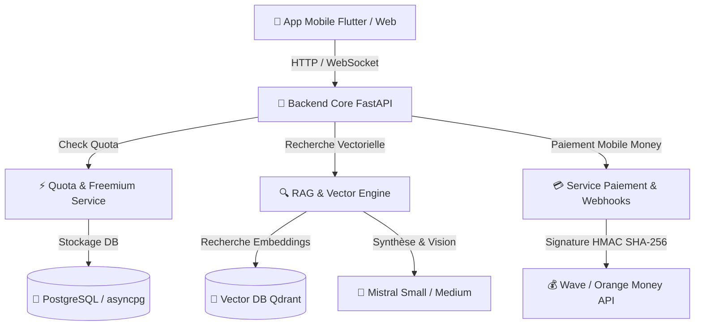

# 📘 Plan de Référence du Projet (PDR) — ProsArtisan IA Expert

Ce document constitue la **Fiche de Référence Produit & Architecture (PDR)** pour l'assistant IA **ProsArtisan**, conçu pour accompagner les artisans du BTP et des métiers d'art en Côte d'Ivoire et en Afrique de l'Ouest.

---

## 🎯 1. Vision & Objectifs Produit

ProsArtisan IA est un copilot technique conversationnel accessible via Web & Mobile. Il résout les défis du terrain :
- **Support Métier Précis** : Réponses techniques structurées étape par étape (maçonnerie, électricité, plomberie, charpente, carrelage, mécanique, maroquinerie, etc.).
- **Compréhension Multilingue & Nouchi** : Prise en charge du français, du Nouchi (argot des chantiers ivoiriens), Dioula, Baoulé et Bété.
- **Multimodalité Photo (Vision Mistral)** : Analyse de photos de chantier (fissures, installations électriques, défaillances mécaniques).
- **Monétisation Mobile Money Locale** : Paiement ultra-simple via Wave Business & Orange Money (Pass 24H Urgence à 500 F CFA, Pass Mensuel Pro à 3000 F CFA, Pack 50 requêtes à 1500 F CFA).
- **Mode Hors-Ligne & Robustesse** : Mémoire locale et réponses rapides sur réseaux mobiles 3G/4G faibles.

---

## 🏗️ 2. Architecture Technique Global



### Stack Technique
- **Langage & Framework** : Python 3.12, FastAPI, Pydantic v2.
- **Base de Données Relationnelle** : PostgreSQL, SQLAlchemy 2.0 (AsyncIO), Asyncpg, Alembic. Pool de connexions dimensionné (`DB_POOL_SIZE`/`DB_MAX_OVERFLOW`/`DB_POOL_RECYCLE`), `pool_pre_ping` actif.
- **Cache & Rate Limiting** : Redis (compteurs de quota/rate-limit partagés entre workers), avec repli en mémoire locale si Redis est indisponible (dev/tests uniquement).
- **Base Vectorielle & RAG** : Qdrant (`qdrant-client`), Embeddings Mistral (`mistral-embed`). La collection est créée automatiquement au démarrage de l'application si elle est absente. Sans extrait pertinent retrouvé (et sans photo à analyser), le service RAG renvoie le message de repli standard sans appeler le LLM (garde-fou zéro hallucination, voir AGENTS.md §3) ; en l'absence de clé Mistral valide, un mode mock déterministe est utilisé pour le développement/les tests.
- **Intelligence Artificielle** : Mistral Small/Medium (texte & vision intégrées), Voxtral (STT/TTS vocal).
- **Paiements & Webhooks** : Wave Business API, Orange Money API, Signatures HMAC SHA-256 (obligatoire, aucun contournement).
- **Découpage & Ingestion PDF** : PyPDF, découpage par phrases entières (jamais coupées en deux) avec chevauchement en proportion du chunk (overlap 10-15%). Métadonnées obligatoires (`metier_id`, `secteur_id`, `type_document`, `niveau_expertise`) validées par document, avec surcharge possible par fichier via `ingestion/documents/metadata.json` (à placer dans le même dossier que les documents passés à `--docs-dir`). IDs de points Qdrant déterministes : ré-ingérer un document met à jour ses points au lieu d'en créer des doublons.
- **Console d'Administration** : Interface statique HTML/JS/CSS (Template Dastone v2.1.0) montée sur `/admin` dans FastAPI.
- **Résilience** : Mécanisme de démarrage dégradé (repli SQLite autonome, hors production uniquement) si PostgreSQL est injoignable. En production (`APP_ENV=production`) ou avec `DB_REQUIRE_POSTGRES=true`, une base injoignable fait échouer le démarrage plutôt que de basculer silencieusement.
- **RBAC & Audit** : les comptes admin peuvent recevoir un rôle granulaire (`app/models/role.py`, permissions type `packages.write`, `audit.read`...) via `require_permission(...)`. Un admin historique sans rôle garde l'accès complet (compatibilité descendante). Toute mutation admin sensible (packages, abonnements, documents, rôles, Pass) est tracée dans `audit_logs` (`app/services/audit_service.py`) : acteur, action, ressource, état avant/après, IP.
- **En-têtes de sécurité HTTP** : `SecurityHeadersMiddleware` pose CSP, `X-Content-Type-Options`, `X-Frame-Options`, `Referrer-Policy`, `Permissions-Policy` sur toutes les réponses, et HSTS en production. `/docs`, `/redoc` et `/openapi.json` sont désactivés quand `APP_ENV=production` (`app.main.docs_urls`).
- **Actualités & Notifications** : `app/models/actualite.py` et `app/services/notification_service.py` alimentent un centre de notifications in-app (source de vérité) avec providers push FCM (mobile, API HTTP v1 authentifiée par compte de service — `FCM_SERVICE_ACCOUNT_PATH`, volontairement pas le SDK `firebase-admin`, non réévalué depuis la bascule vers `mistralai`) et Web Push/VAPID (`chat_web`), et un module Actualités ciblable par métier, diffusable en tâche de fond.
- **PWA (`chat_web`)** : `manifest.json` + `sw.js` — shell installable, disponible hors-ligne (jamais les réponses API), écoute des notifications Web Push. Clé VAPID de développement fonctionnelle par défaut, à régénérer en production.
- **Mobile (`mobile_app_flutter`)** : `flutter_secure_storage` (JWT), `hive`/`connectivity_plus` (file d'attente hors-ligne), `local_auth` (verrouillage biométrique optionnel), `firebase_messaging`/`sentry_flutter` (inactifs sans credentials Firebase/Sentry fournis par l'opérateur).

---

## 📁 3. Arborescence du Projet

```text
AssistantIA-prosartisan/
├── app/
│   ├── config.py             # Paramètres centralisés (Pydantic Settings)
│   ├── main.py               # Point d'entrée FastAPI & middlewares CORS
│   ├── db/                   # Connexion asyncpg & initialisation des tables
│   ├── models/               # Modèles ORM (User, Quota, Transaction, Metier)
│   ├── schemas/              # Schémas Pydantic (Chat, Payment, Quota, User)
│   ├── services/             # Logique Métier (RAG, Quota, Payment)
│   └── routers/              # Endpoints API (chat, payment, quota, admin, health)
├── admin_web/                # Back-Office statique (HTML/JS/CSS, base : template Dastone v2.1.0)
├── chat_web/                 # Front-Office chat statique (HTML/JS/CSS)
├── mobile_app_flutter/       # Application mobile Flutter (Android prioritaire)
├── ingestion/
│   ├── pipeline.py           # Pipeline PDF → Chunks sémantiques → Qdrant
│   └── documents/            # Guides et fiches techniques PDF par métier
├── prompts/
│   └── system_prompt.txt     # Prompt système multilingue & garde-fous RAG
├── tests/                    # Test suite Pytest (100% couverture endpoints)
├── AGENTS.md                 # Règles & directives d'ingénierie du projet
├── PDR.md                    # Document de Référence Produit & Architecture
└── requirements.txt          # Dépendances pip du projet
```

---

## 💳 4. Offres & Modèle Économique (Mobile Money)

| Offre | Code | Tarif (FCFA) | Contenu |
| :--- | :--- | :--- | :--- |
| **Pass Gratuit** | `FREE` | **0 F** | 5 questions gratuites par jour |
| **Pass 24H Urgence** | `pass_24h` | **500 F** | Accès illimité pendant 24h chrono |
| **Pass Mensuel Pro** | `pass_mois` | **3 000 F** | Accès illimité pendant 30 jours |
| **Pack 50 Requêtes** | `pack_50_requetes` | **1 500 F** | Crédit de 50 questions sans limite de temps |

---

## 🛡️ 5. Endpoints API Principaux

Sur toutes les routes ci-dessous, l'identité de l'artisan est déduite du JWT (`Authorization: Bearer ...`) quand il est fourni ; en son absence, un compte anonyme partagé est utilisé pour le mode non connecté. Aucune route n'accepte plus un `user_id` fourni par le client (corps, query ou chemin) — voir AGENTS.md §2.

**Authentification** (`/api/auth`)

- `POST /register`, `POST /login` : inscription et connexion par email/mot de passe. `login` exige un `totp_code` supplémentaire si le compte admin a activé la 2FA.
- `POST /google` : connexion/inscription via Google OAuth 2.0.
- `POST /refresh` : renouvelle l'access token à partir d'un refresh token valide ; l'ancien refresh token est révoqué dès son utilisation (rotation à usage unique).
- `POST /logout` : révoque explicitement un refresh token (déconnexion).
- `POST /totp/setup`, `POST /totp/enable`, `POST /totp/disable` : activation/désactivation de la 2FA (TOTP), réservée aux comptes admin.
- `GET /me` : profil de l'artisan connecté (JWT requis).

**Chat & Historique**

- `POST /api/chat` : Pose une question technique (texte + photo `image_url` optionnelle + filtre `metier_id`). Intercepte les quotas épuisés avec `HTTP 402 Payment Required`.
- `POST /api/chat/stream` : équivalent en streaming SSE.
- `POST /api/chat/transcribe` : transcription vocale (Mistral Voxtral) d'une note audio de chantier.
- `WS /api/chat/ws` : Stream WebSocket en temps réel. Identité déduite d'un JWT optionnel en query param (`?token=...`, un WebSocket ne portant pas d'en-tête `Authorization` côté client), sinon compte anonyme partagé ; quota décrémenté à chaque message comme sur les routes HTTP.
- `GET/POST /api/conversations`, `GET/PATCH/DELETE /api/conversations/{id}` : historique des discussions, strictement cloisonné par propriétaire.

**Paiement Mobile Money** (`/api/payment`)

- `GET /tarifs` : grille tarifaire des Pass et Packs.
- `POST /init` : initialise un paiement Wave ou Orange Money (JWT requis — l'utilisateur ne peut initier un paiement que pour son propre compte).
- `POST /webhook` : webhook sécurisé par signature HMAC SHA-256 (`X-Signature` obligatoire, aucune exception) et idempotent (un webhook rejoué sur une transaction déjà aboutie ne re-crédite pas le Pass).

**Quota**

- `GET /api/quota` : solde de questions et statut d'abonnement de l'artisan courant.

**Notifications** (`/api/notifications`)

- `GET /` : liste des notifications de l'utilisateur connecté (filtre `unread_only`).
- `GET /unread-count` : nombre de notifications non lues.
- `PATCH /{id}/read` : marque une notification comme lue (filtrée par propriétaire).
- `POST /register-device` : enregistre le jeton d'appareil (FCM, mobile) pour les notifications push.
- `GET /vapid-public-key` (public) : clé publique VAPID pour `PushManager.subscribe()` côté navigateur.
- `POST /web-push/subscribe`, `POST /web-push/unsubscribe` : gestion de l'abonnement Web Push (chat_web).

**Back-Office Admin** (`/api/admin`, JWT admin requis)

- `POST /upload-pdf` : upload d'un PDF technique ; l'ingestion (extraction, découpage, embeddings, indexation Qdrant) s'exécute en tâche de fond et la réponse (`202 Accepted`) est immédiate.
- `GET /stats`, `GET /overview`, `GET /users`, `POST /users/{id}/grant-pass`, `GET /documents`, `DELETE /documents/{id}`, `GET /transactions`, `GET /logs`.
- **RBAC** : `GET /roles`, `GET /permissions`, `POST /users/{id}/role` (assigne ou retire un rôle RBAC — permissions `roles.read`/`roles.write`). Un admin sans rôle assigné garde l'accès complet historique ; un admin avec un rôle n'a que les permissions accordées à ce rôle.
- **Audit** : `GET /audit-logs` (permission `audit.read`) — journal filtrable (acteur, action, type de ressource) de toutes les mutations admin sensibles (packages, abonnements, documents, rôles, Pass attribués).
- **Sécurité** : `GET /security-stats` (permission `audit.read`) — actions admin des dernières 24h, tentatives de connexion échouées, webhooks rejetés et tokens révoqués (fenêtre glissante 30 jours).
- **Actualités** (permissions `actualites.read`/`actualites.write`) : `GET/POST /actualites`, `PUT /actualites/{id}`, `POST /actualites/{id}/publish|unpublish`, `DELETE /actualites/{id}`, `GET /actualites/suggestions` (sujets suggérés à partir des conversations les plus mal notées).
- **Notifications** (permission `notifications.send`) : `POST /notifications/broadcast` — composition et diffusion (in-app ou push) vers tous les artisans ou ceux d'un métier ciblé, exécutée en tâche de fond.

---

## 🧪 6. Procédures de Vérification & Qualité

Pour lancer la suite de tests automatisés :
```bash
.\.venv\Scripts\pytest.exe tests/ -v
```

Pour exécuter le pipeline d'ingestion sémantique :
```bash
python -m ingestion.pipeline --docs-dir ./ingestion/documents --metier-id 1
```
