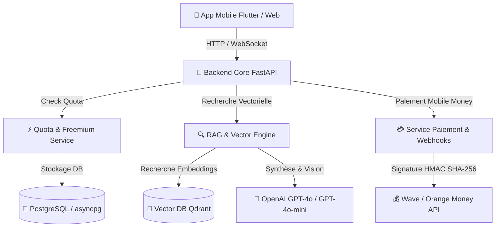

# 📘 Plan de Référence du Projet (PDR) — ProsArtisan IA Expert

Ce document constitue la **Fiche de Référence Produit & Architecture (PDR)** pour l'assistant IA **ProsArtisan**, conçu pour accompagner les artisans du BTP et des métiers d'art en Côte d'Ivoire et en Afrique de l'Ouest.

---

## 🎯 1. Vision & Objectifs Produit

ProsArtisan IA est un copilot technique conversationnel accessible via Web & Mobile. Il résout les défis du terrain :
- **Support Métier Précis** : Réponses techniques structurées étape par étape (maçonnerie, électricité, plomberie, charpente, carrelage, mécanique, maroquinerie, etc.).
- **Compréhension Multilingue & Nouchi** : Prise en charge du français, du Nouchi (argot des chantiers ivoiriens), Dioula, Baoulé et Bété.
- **Multimodalité Photo (GPT-4o Vision)** : Analyse de photos de chantier (fissures, installations électriques, défaillances mécaniques).
- **Monétisation Mobile Money Locale** : Paiement ultra-simple via Wave Business & Orange Money (Pass 24H Urgence à 500 F CFA, Pass Mensuel Pro à 3000 F CFA, Pack 50 requêtes à 1500 F CFA).
- **Mode Hors-Ligne & Robustesse** : Mémoire locale et réponses rapides sur réseaux mobiles 3G/4G faibles.

---

## 🏗️ 2. Architecture Technique Global



### Stack Technique
- **Langage & Framework** : Python 3.12, FastAPI, Pydantic v2.
- **Base de Données Relationnelle** : PostgreSQL, SQLAlchemy 2.0 (AsyncIO), Asyncpg, Alembic.
- **Base Vectorielle & RAG** : Qdrant (`qdrant-client`), Embeddings OpenAI (`text-embedding-3-small`).
- **Intelligence Artificielle** : OpenAI GPT-4o (Vision) & GPT-4o-mini, Whisper API (Vocal).
- **Paiements & Webhooks** : Wave Business API, Orange Money API, Signatures HMAC SHA-256.
- **Découpage & Ingestion PDF** : PyPDF, Semantic Chunking (overlap 10-15%).

---

## 📁 3. Arborescence du Projet

```text
AssistantIA-prosartisan/
├── app/
│   ├── config.py             # Paramètres centralisés (Pydantic Settings)
│   ├── main.py               # Point d'entrée FastAPI & middlewares CORS
│   ├── db/                   # Connexion asyncpg & initialisation des tables
│   ├── models/               # Modèles ORM (User, Quota, Transaction, Metier)
│   ├── schemas/              # Schémas Pydantic (Chat, Payment, Quota, User)
│   ├── services/             # Logique Métier (RAG, Quota, Payment)
│   └── routers/              # Endpoints API (chat, payment, quota, admin, health)
├── ingestion/
│   ├── pipeline.py           # Pipeline PDF → Chunks sémantiques → Qdrant
│   └── documents/            # Guides et fiches techniques PDF par métier
├── prompts/
│   └── system_prompt.txt     # Prompt système multilingue & garde-fous RAG
├── tests/                    # Test suite Pytest (100% couverture endpoints)
├── AGENTS.md                 # Règles & directives d'ingénierie du projet
├── PDR.md                    # Document de Référence Produit & Architecture
└── requirements.txt          # Dépendances pip du projet
```

---

## 💳 4. Offres & Modèle Économique (Mobile Money)

| Offre | Code | Tarif (FCFA) | Contenu |
| :--- | :--- | :--- | :--- |
| **Pass Gratuit** | `FREE` | **0 F** | 5 questions gratuites par jour |
| **Pass 24H Urgence** | `pass_24h` | **500 F** | Accès illimité pendant 24h chrono |
| **Pass Mensuel Pro** | `pass_mois` | **3 000 F** | Accès illimité pendant 30 jours |
| **Pack 50 Requêtes** | `pack_50_requetes` | **1 500 F** | Crédit de 50 questions sans limite de temps |

---

## 🛡️ 5. Endpoints API Principaux

- `POST /api/chat` : Pose une question technique (supporte texte + photo `image_url` + filtre `metier_id`). Intercepte les quotas épuisés avec `HTTP 402 Payment Required`.
- `WS /api/chat/ws` : Stream WebSocket en temps réel pour l'application mobile.
- `POST /api/payment/init` : Initialise un paiement Wave ou Orange Money.
- `POST /api/payment/webhook` : Webhook sécurisé par signature HMAC SHA-256 (`X-Signature`).
- `GET /api/quota/{user_id}` : Consultation du solde et du statut d'abonnement.
- `POST /api/admin/upload-pdf` : Upload et ingestion de PDF techniques par le back-office.

---

## 🧪 6. Procédures de Vérification & Qualité

Pour lancer la suite de tests automatisés :
```bash
.\.venv\Scripts\pytest.exe tests/ -v
```

Pour exécuter le pipeline d'ingestion sémantique :
```bash
python -m ingestion.pipeline --docs-dir ./ingestion/documents --metier-id 1
```
