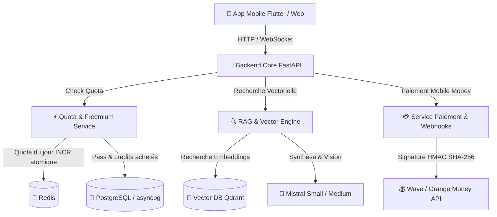

# 📘 Document des Exigences Produit (PRD/PDR) — ProsArtisan IA Expert

Ce document constitue le **Product Requirements Document (PRD)** et la **Fiche de Référence Produit & Architecture (PDR)** de l'assistant IA **ProsArtisan**, conçu pour accompagner les artisans du BTP et des métiers d'art en Côte d'Ivoire et en Afrique de l'Ouest. Le fichier historique reste nommé `PDR.md`, mais il est la source de vérité produit du dépôt.

---

## 🎯 1. Vision & Objectifs Produit

ProsArtisan IA est un copilot technique conversationnel accessible via Web & Mobile. Il résout les défis du terrain :
- **Support Métier Précis** : Réponses techniques structurées étape par étape (maçonnerie, électricité, plomberie, charpente, carrelage, mécanique, maroquinerie, etc.).
- **Compréhension Multilingue & Nouchi** : Prise en charge du français, du Nouchi (argot des chantiers ivoiriens), Dioula, Baoulé et Bété.
- **Multimodalité Photo (Vision Mistral)** : Analyse de photos de chantier (fissures, installations électriques, défaillances mécaniques).
- **Monétisation Mobile Money Locale** : Paiement ultra-simple via Wave Business & Orange Money (Pass 24H Urgence à 500 F CFA, Pass Mensuel Pro à 3000 F CFA, Pack 50 requêtes à 1500 F CFA).
- **Mode Hors-Ligne & Robustesse** : Mémoire locale et réponses rapides sur réseaux mobiles 3G/4G faibles.

---

## 🏗️ 2. Architecture Technique Global



### Stack Technique
- **Langage & Framework** : Python 3.12, FastAPI, Pydantic v2.
- **Base de Données Relationnelle** : PostgreSQL, SQLAlchemy 2.0 (AsyncIO), Asyncpg, Alembic. Pool de connexions dimensionné (`DB_POOL_SIZE`/`DB_MAX_OVERFLOW`/`DB_POOL_RECYCLE`), `pool_pre_ping` actif.
- **Cache & Rate Limiting** : Redis (compteurs de quota/rate-limit partagés entre workers), avec repli en mémoire locale si Redis est indisponible (dev/tests uniquement) ; une connexion Redis perdue est retentée toutes les 30 s. En production, les préfixes `prosartisan:security:`, `prosartisan:revoked_jti:`, `prosartisan:rate_limit:` et `prosartisan:quota:` refusent le repli mémoire. Le rate limiting (60 req/min par IP) couvre `/api/chat*`, `/api/auth*` et chaque message du WebSocket `/api/chat/ws`. L'IP cliente est lue dans `X-Forwarded-For` en partant de la droite selon `TRUSTED_PROXY_HOPS` (nombre de reverse proxies de confiance : 1 derrière Caddy/Render/Cloud Run, 0 en accès direct).
- **Quotas freemium** (`app/services/quota_service.py`) : ordre de consommation Pass premium actif → quota gratuit du jour (`MAX_QUESTIONS_GRATUITES_PAR_JOUR`, compteur Redis `INCR` atomique par jour UTC = heure d'Abidjan, expirant seul — aucune tâche de remise à zéro) → crédits achetés (`quotas_utilisateurs.credits_requetes`, décrémentés par `UPDATE ... WHERE credits_requetes > 0`). Un visiteur non connecté est compté par IP cliente (hachée), jamais sur un compteur commun à tous les anonymes. Redis injoignable en production → `503` (jamais un quota accordé ou refusé à l'aveugle).
- **Base Vectorielle & RAG** : Qdrant (`qdrant-client`), Embeddings Mistral (`mistral-embed`). La collection est créée automatiquement au démarrage de l'application si elle est absente. Sans extrait pertinent retrouvé (et sans photo à analyser), le service RAG renvoie le message de repli standard sans appeler le LLM (garde-fou zéro hallucination, voir AGENTS.md §3) ; en l'absence de clé Mistral valide, un mode mock déterministe est utilisé pour le développement/les tests. Les modes réponse complète et streaming partagent la même préparation (`RAGService._prepare`) : métier suspendu, cache, repli zéro hallucination et calculateurs certifiés (en streaming, les appels d'outil sont reconstitués depuis le flux, exécutés, puis la réponse finale est streamée). La recherche utilise `query_points` (Qdrant). Les états d'activation (métiers et documents désactivés) sont mis en cache Redis 60 s et invalidés par les routes admin (`invalidate_activation_cache`) ; chaque invalidation, et chaque ingestion ayant traité un document, change la version des réponses RAG en cache (clé `prosartisan:rag:v<version>:...`), qui ne peuvent donc plus citer un document désactivé ni masquer un document nouvellement ajouté. Les embeddings d'ingestion sont calculés par lots de 16.
- **Intelligence Artificielle** : Mistral Small/Medium (texte & vision intégrées), Voxtral (STT/TTS vocal).
- **Paiements & Webhooks** (`app/services/payment_providers/`) : parcours officiels **Wave Checkout** (session `cos-...` + `wave_launch_url`, webhook `checkout.session.completed` / `checkout.session.payment_failed` signé `Wave-Signature: t=…,v1=HMAC-SHA256(secret, t + corps)`, fenêtre anti-rejeu `PAYMENT_WEBHOOK_TOLERANCE_SECONDS`) et **Orange Money WebPay** (jeton OAuth2, `webpayment` → `pay_token` / `payment_url` / `notif_token`, notification `{status, notif_token, txnid}` authentifiée par `notif_token` puis **confirmée par `transactionstatus`** avant tout crédit, la notification n'étant pas signée). `PAYMENT_MODE=demo` (défaut, en attendant les accès officiels) : simulateur local qui reproduit ces parcours à l'identique (mêmes identifiants, formats de notification et signatures, page de paiement `/api/payment/demo/checkout/{session}` sans débit réel) ; `PAYMENT_MODE=live` : API officielles (identifiants `WAVE_*` / `ORANGE_*` et `PUBLIC_BASE_URL` HTTPS exigés au démarrage en production). En production, le mode démo refuse tout paiement (`503`) sauf `PAYMENT_DEMO_IN_PRODUCTION=true`. Un paiement abouti est enregistré `ACCEPTED` (échec `FAILED`, expiration `EXPIRED`), crédité une seule fois et seulement si le montant confirmé par l'opérateur est exact ; un Pass payé met aussi à jour `users.type_abonnement` (statistiques admin, ciblage des actualités), comme une attribution admin. `python -m app.scripts.reconcile_payments` (à planifier toutes les 10-15 min) rattrape les notifications perdues.
- **Historique des discussions** : réservé aux utilisateurs connectés. Un visiteur non connecté n'a aucune discussion côté serveur (`conversation_id` renvoyé à `null`, `conversation_id` fourni → `401`) ; `chat_web` conserve son historique dans le navigateur (`localStorage`, 20 discussions × 60 messages, sans photos). L'ancien compte anonyme partagé (discussions lisibles par tout visiteur) n'est plus alimenté ; l'existant se supprime avec `python -m app.scripts.purge_anonymous_history [--dry-run]`.
- **Découpage & Ingestion PDF** : PyPDF, découpage par phrases entières (jamais coupées en deux) avec chevauchement en proportion du chunk (overlap 10-15%). Métadonnées obligatoires (`metier_id`, `secteur_id`, `type_document`, `niveau_expertise`) validées par document, avec surcharge possible par fichier via `ingestion/documents/metadata.json` (à placer dans le même dossier que les documents passés à `--docs-dir`). IDs de points Qdrant déterministes : ré-ingérer un document met à jour ses points au lieu d'en créer des doublons ; après l'upsert, les points d'index supérieur ou égal au nouveau nombre de chunks (document raccourci) sont purgés, et un échec de purge est remonté dans les erreurs d'ingestion.
- **Photos de chantier** (`app/services/media_service.py`) : chat_web réencode chaque photo en JPEG (1600 px maximum) avant l'envoi — une photo HEIC n'est acceptée que si le navigateur sait la lire, sinon un message l'indique ; une photo Base64 est validée côté serveur (PNG/JPEG/WebP/GIF, signature binaire, 7 Mo maximum — `422` sinon, **avant** tout décompte de quota), écrite dans `UPLOAD_DIR/chat_images/` et la base ne conserve qu'une référence `media:<nom>`. L'historique expose une URL signée HMAC valable 1 h (`GET /api/media/chat-images/{nom}?exp=&sig=`), délivrée au seul propriétaire de la discussion. Les photos déjà stockées en Base64 se reprennent avec `python -m app.scripts.migrate_chat_images` (idempotent, `--dry-run`). `UPLOAD_DIR` doit être un stockage persistant (volume `prod_uploads` en Docker Compose ; disque persistant ou volume monté sur Render / Cloud Run, dont le système de fichiers est éphémère).
- **Console d'Administration** : Interface statique HTML/JS/CSS (Template Dastone v2.1.0) montée sur `/admin` dans FastAPI. Le JavaScript est découpé par domaine dans `admin_web/js/` (scripts classiques chargés dans l'ordre par `index.html`, `core.js` en premier) ; l'API correspondante est le paquet `app/routers/admin/` (`contenus`, `utilisateurs`, `offres`, `securite`, `communication`, `supervision`), regroupé sous `/api/admin`. L'upload de documents n'accepte qu'un nom de fichier sûr (dernière composante, caractères limités) et 25 Mo maximum. La session du back-office repose sur un cookie JWT `HttpOnly`, `SameSite=Strict` (`Secure` en production), jamais sur `localStorage`.
- **Résilience** : Mécanisme de démarrage dégradé (repli SQLite autonome, hors production uniquement) si PostgreSQL est injoignable. En production (`APP_ENV=production`) ou avec `DB_REQUIRE_POSTGRES=true`, une base injoignable fait échouer le démarrage plutôt que de basculer silencieusement.
- **RBAC & Audit** : les comptes admin peuvent recevoir un rôle granulaire (`app/models/role.py`, permissions type `packages.write`, `audit.read`...) via `require_permission(...)`. Un admin historique sans rôle garde l'accès complet (compatibilité descendante). Toute mutation admin sensible (packages, abonnements, documents, rôles, Pass) est tracée dans `audit_logs` (`app/services/audit_service.py`) : acteur, action, ressource, état avant/après, IP.
- **En-têtes de sécurité HTTP** : `SecurityHeadersMiddleware` pose CSP, `X-Content-Type-Options`, `X-Frame-Options`, `Referrer-Policy`, `Permissions-Policy` sur toutes les réponses, et HSTS en production. Les blocs `<script>` inline sont interdits ; styles et polices tiers limités à Google Fonts (`fonts.googleapis.com` / `fonts.gstatic.com`) et cdnjs ; les données dynamiques injectées dans le DOM sont encodées. `/docs`, `/redoc` et `/openapi.json` sont désactivés quand `APP_ENV=production` (`app.main.docs_urls`).
- **Authentification & dépendances** : les JWT sont signés avec PyJWT ; les refresh tokens sont rotatifs et révocables par `jti`, et seuls les tokens `type=access` ouvrent les routes protégées (un refresh token présenté en `Bearer` est refusé en `401`). Google OAuth valide obligatoirement l'audience (`GOOGLE_CLIENT_ID`), l'émetteur et l'état `email_verified`. L'audit `pip-audit` est bloquant en CI.
- **Actualités & Notifications** : `app/models/actualite.py` et `app/services/notification_service.py` alimentent un centre de notifications in-app (source de vérité) avec providers push FCM (mobile, API HTTP v1 authentifiée par compte de service — `FCM_SERVICE_ACCOUNT_PATH`, volontairement pas le SDK `firebase-admin`, non réévalué depuis la bascule vers `mistralai`) et Web Push/VAPID (`chat_web`), et un module Actualités ciblable par métier, diffusable en tâche de fond.
- **PWA (`chat_web`)** : `manifest.json` + `sw.js` — shell installable, disponible hors-ligne (jamais les réponses API), écoute des notifications Web Push. Clé VAPID de développement fonctionnelle par défaut, à régénérer en production.
- **Mobile (`mobile_app_flutter`)** : `flutter_secure_storage` (JWT), `hive`/`connectivity_plus` (file d'attente hors-ligne), `local_auth` (verrouillage biométrique optionnel), `firebase_messaging`/`sentry_flutter` (inactifs sans credentials Firebase/Sentry fournis par l'opérateur).

---

## 📁 3. Arborescence du Projet

```text
AssistantIA-prosartisan/
├── app/
│   ├── config.py             # Paramètres centralisés (Pydantic Settings)
│   ├── main.py               # Point d'entrée FastAPI & middlewares CORS
│   ├── db/                   # Connexion asyncpg & initialisation des tables
│   ├── models/               # Modèles ORM (User, Quota, Transaction, Metier)
│   ├── schemas/              # Schémas Pydantic (Chat, Payment, Quota, User)
│   ├── services/             # Logique Métier (RAG, Quota, Payment)
│   ├── scripts/              # Scripts d'exploitation (reprise des photos Base64)
│   └── routers/              # Endpoints API (chat, payment, quota, media, health…)
│       └── admin/            # Back-office API découpé par domaine
├── admin_web/                # Back-Office statique (HTML/CSS, base : template Dastone v2.1.0)
│   └── js/                   # Scripts du back-office par domaine (core.js chargé en premier)
├── chat_web/                 # Front-Office chat statique (HTML/JS/CSS)
├── mobile_app_flutter/       # Application mobile Flutter (Android prioritaire)
├── ingestion/
│   ├── pipeline.py           # Pipeline PDF → Chunks sémantiques → Qdrant
│   └── documents/            # Guides et fiches techniques PDF par métier
├── prompts/
│   └── system_prompt.txt     # Prompt système multilingue & garde-fous RAG
├── tests/                    # Test suite Pytest (100% couverture endpoints)
├── AGENTS.md                 # Règles & directives d'ingénierie du projet
├── PDR.md                    # Document de Référence Produit & Architecture
└── requirements.txt          # Dépendances pip du projet
```

---

## 💳 4. Offres & Modèle Économique (Mobile Money)

| Offre | Code | Tarif (FCFA) | Contenu |
| :--- | :--- | :--- | :--- |
| **Pass Gratuit** | `FREE` | **0 F** | 5 questions gratuites par jour |
| **Pass 24H Urgence** | `pass_24h` | **500 F** | Accès illimité pendant 24h chrono |
| **Pass Mensuel Pro** | `pass_mois` | **3 000 F** | Accès illimité pendant 30 jours |
| **Pack 50 Requêtes** | `pack_50_requetes` | **1 500 F** | Crédit de 50 questions sans limite de temps |

---

## 🛡️ 5. Endpoints API Principaux

Sur toutes les routes ci-dessous, l'identité de l'artisan est déduite du JWT (`Authorization: Bearer ...`) quand il est fourni ; en son absence, le visiteur est anonyme : réponses servies, mais aucun historique conservé côté serveur (quota compté par IP). Aucune route n'accepte plus un `user_id` fourni par le client (corps, query ou chemin) — voir AGENTS.md §2.

**Authentification** (`/api/auth`)

- `POST /register`, `POST /login` : inscription et connexion par email/mot de passe. `login` exige un `totp_code` supplémentaire si le compte admin a activé la 2FA.
- `POST /google` : connexion/inscription via Google OAuth 2.0.
- `GET /google/config` : expose uniquement l'identifiant client OAuth public nécessaire à Google Identity Services.
- `POST /refresh` : renouvelle l'access token à partir d'un refresh token valide ; l'ancien refresh token est révoqué dès son utilisation (rotation à usage unique).
- `POST /logout` : révoque explicitement un refresh token (déconnexion).
- `POST /session/logout` : supprime le cookie de session `HttpOnly` du back-office.
- `POST /totp/setup`, `POST /totp/enable`, `POST /totp/disable` : activation/désactivation de la 2FA (TOTP), réservée aux comptes admin.
- `GET /me` : profil de l'artisan connecté (JWT requis).

**Chat & Historique**

- `POST /api/chat` : Pose une question technique (texte + photo `image_url` optionnelle + filtre `metier_id`). Intercepte les quotas épuisés avec `HTTP 402 Payment Required` (`503` si le compteur de quota est indisponible). Panne du fournisseur IA : `503` explicite et **question rendue** (`quota_service.restituer_quota` : compteur du jour décrémenté, ou crédit acheté recrédité). Sans `metier_id`, la recherche couvre tous les métiers. Entrées bornées : question ≤ 4000 caractères, `image_url` ≤ 10 M caractères (`422` au-delà).
- `POST /api/chat/stream` : équivalent en streaming SSE (mêmes garanties que `/api/chat`, dont calculateurs et cache). Une erreur du fournisseur IA en cours de flux produit un `event: error` dont la donnée est un message texte, suivi de `[DONE]` ; la question est rendue et les clients (chat_web, Flutter) l'affichent comme une erreur, jamais comme une réponse (ni historique, ni file hors-ligne). Chaque morceau de réponse est une chaîne JSON (`data: "texte"`).
- `GET /api/metiers` : métiers actifs (`id`, `nom`, `slug`), public. Les identifiants sont propres à chaque base : les clients les lisent ici, jamais codés en dur.
- `GET /api/media/chat-images/{nom}?exp=&sig=` : photo de chantier via URL signée (404 identique pour signature invalide, expirée ou fichier absent).
- `POST /api/chat/transcribe` : transcription vocale (Mistral Voxtral) d'une note audio de chantier (10 Mo maximum, `413` au-delà).
- `POST /api/chat/synthesize` : synthèse vocale (Voxtral TTS) d'un texte de 2000 caractères maximum.
- `POST /api/chat/feedback` : pouce haut/bas ; un `conversation_id` fourni doit appartenir à l'appelant (`404` sinon).
- `WS /api/chat/ws` : Stream WebSocket en temps réel. Le JWT optionnel est envoyé dans un premier message d'authentification (`{"action": "auth", "token": "...", "conversation_id": "..."}`), jamais dans l'URL ; sans jeton, le visiteur est anonyme (quota compté par IP, aucune discussion rattachable : `error` « Connectez-vous… »). Une `conversation_id` (dans l'auth ou dans un message) doit appartenir à l'appelant connecté : son historique est chargé et les échanges y sont enregistrés. Notes vocales : `{"type": "voice", "audio", "format"}` ou `{"action": "audio_chunk", "audio", "audio_format": "audio/webm"}` (format de `chat_web`), 10 Mo maximum. Taille, propriété, rate limiting et quota sont vérifiés **avant** la transcription Voxtral (facturée). Réponses : `user_transcription`, fragments `stream` réels du LLM, `stream_end` (réponse complète + sources), puis `audio_response` + `voice_turn_completed` pour la voix ; une erreur du fournisseur IA envoie un `error` sans fermer la session.
- `GET/POST /api/conversations`, `GET/PATCH/DELETE /api/conversations/{id}` : historique des discussions, **JWT obligatoire** (`401` sinon), strictement cloisonné par propriétaire. `/api/chat` et `/api/chat/stream` vérifient la propriété d'une `conversation_id` **avant** tout décompte (`401` anonyme, `404` discussion d'un tiers — jamais d'écriture dans la discussion d'un autre).

**Paiement Mobile Money** (`/api/payment`)

- `GET /tarifs` : grille tarifaire des Pass et Packs.
- `GET /tarifs` renvoie aussi `operateurs`, `mode` (`demo` / `live`) et `disponible`.
- `POST /init` : `{type_pass, operateur: WAVE | ORANGE}` (JWT requis). Enregistre la transaction `PENDING`, crée le paiement chez l'opérateur (ou le simulateur) et renvoie `payment_url`, `transaction_id`, `mode`. Aucune URL si la transaction n'a pas pu être enregistrée (`500`) ; opérateur injoignable ou démo désactivée en production → `503`. Retour de l'opérateur vers `/chat/?transaction=<id>&paiement=succes|echec`.
- `GET /transactions/{id}` : statut d'une transaction de l'appelant (`PENDING`, `ACCEPTED`, `FAILED`, `EXPIRED`, `REFUNDED`), filtré par propriétaire.
- `POST /webhooks/wave` : webhook Wave Checkout, `Wave-Signature` obligatoire (`401` sinon, compteur de sécurité).
- `POST /webhooks/orange-money` : notification Orange Money WebPay, `notif_token` connu obligatoire (`401` sinon), crédit seulement après confirmation `transactionstatus`.
- `GET|POST /demo/checkout/{session}` : page du simulateur d'opérateur (mode démo uniquement, `404` sinon).
- `POST /webhook` : webhook générique (agrégateur) sécurisé par signature HMAC SHA-256 (`X-Signature` obligatoire, aucune exception) et idempotent (un webhook rejoué sur une transaction déjà aboutie ne re-crédite pas le Pass). Un statut abouti n'est crédité que si le champ `montant` (FCFA) égale exactement le montant de la transaction ; sinon `400` et la transaction reste `PENDING`. Le Pack 50 ajoute 50 à `credits_requetes`.

**Quota**

- `GET /api/quota` : solde de questions et statut d'abonnement de l'artisan courant (ou du visiteur anonyme, par IP) : `statut`, `restantes` (gratuites du jour + crédits, `999999` si Pass actif), `gratuites_restantes_jour`, `credits`, `date_fin_premium`, `is_allowed`.

**Notifications** (`/api/notifications`)

- `GET /` : liste des notifications de l'utilisateur connecté (filtre `unread_only`).
- `GET /unread-count` : nombre de notifications non lues.
- `PATCH /{id}/read` : marque une notification comme lue (filtrée par propriétaire).
- `POST /register-device` : enregistre le jeton d'appareil (FCM, mobile) pour les notifications push.
- `GET /vapid-public-key` (public) : clé publique VAPID pour `PushManager.subscribe()` côté navigateur.
- `POST /web-push/subscribe`, `POST /web-push/unsubscribe` : gestion de l'abonnement Web Push (chat_web).

**Back-Office Admin** (`/api/admin`, JWT admin requis)

- `POST /upload-pdf` : upload d'un PDF technique ; l'ingestion (extraction, découpage, embeddings, indexation Qdrant) s'exécute en tâche de fond et la réponse (`202 Accepted`) est immédiate.
- `GET /stats`, `GET /overview`, `GET /users`, `POST /users/{id}/grant-pass`, `GET /documents`, `DELETE /documents/{id}`, `GET /transactions`, `GET /logs`.
- **RBAC** : `GET /roles`, `GET /permissions`, `POST /users/{id}/role` (assigne ou retire un rôle RBAC — permissions `roles.read`/`roles.write`). Un admin sans rôle assigné garde l'accès complet historique ; un admin avec un rôle n'a que les permissions accordées à ce rôle.
- **Audit** : `GET /audit-logs` (permission `audit.read`) — journal filtrable (acteur, action, type de ressource) de toutes les mutations admin sensibles (packages, abonnements, documents, rôles, Pass attribués).
- **Sécurité** : `GET /security-stats` (permission `audit.read`) — actions admin des dernières 24h, tentatives de connexion échouées, webhooks rejetés et tokens révoqués (fenêtre glissante 30 jours).
- **Actualités** (permissions `actualites.read`/`actualites.write`) : `GET/POST /actualites`, `PUT /actualites/{id}`, `POST /actualites/{id}/publish|unpublish`, `DELETE /actualites/{id}`, `GET /actualites/suggestions` (sujets suggérés à partir des conversations les plus mal notées).
- **Notifications** (permission `notifications.send`) : `POST /notifications/broadcast` — composition et diffusion (in-app ou push) vers tous les artisans ou ceux d'un métier ciblé, exécutée en tâche de fond.

---

## 🧪 6. Procédures de Vérification & Qualité

Pour lancer la suite de tests automatisés :
```bash
.\.venv\Scripts\pytest.exe tests/ -v
```

Pour exécuter le pipeline d'ingestion sémantique :
```bash
python -m ingestion.pipeline --docs-dir ./ingestion/documents --metier-id 1
```

---

## 📝 7. Gouvernance documentaire obligatoire

Avant **chaque commit** puis avant **chaque push**, toute implémentation ou modification, même mineure, impose une vérification et une mise à jour systématiques de la documentation de référence dans le **même lot de modifications** :

1. `PDR.md`, lorsque le comportement produit, l'architecture, les endpoints, les intégrations, les contraintes ou les procédures de validation changent ;
2. `AGENTS.md`, lorsqu'une règle d'ingénierie, de sécurité, de qualité ou de livraison est ajoutée ou modifiée ;
3. `CLAUDE.md` et `.agents/rules/project_rules.md`, afin que tous les assistants et IDE appliquent les mêmes règles ;
4. `.env.example`, les fichiers de déploiement et le `README.md` lorsqu'une variable, une commande ou une procédure d'exploitation change.

Le contrôle documentaire constitue une étape bloquante de la livraison : aucun `git commit` ni `git push` ne doit être exécuté avant d'avoir vérifié et, si nécessaire, actualisé chacun de ces fichiers. Même lorsqu'aucun contenu métier ne change, les fichiers doivent être relus avant le commit et le push ; le compte rendu doit alors confirmer explicitement qu'ils sont toujours à jour. Une implémentation est **incomplète** tant que cette vérification n'a pas été effectuée.
